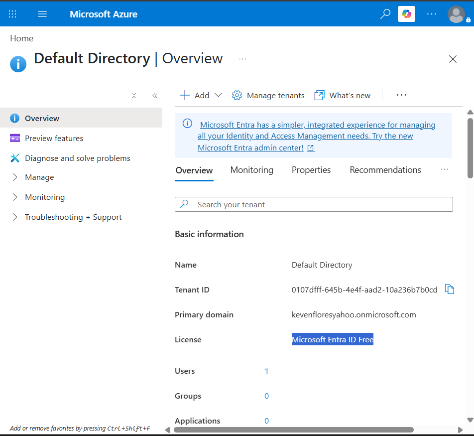
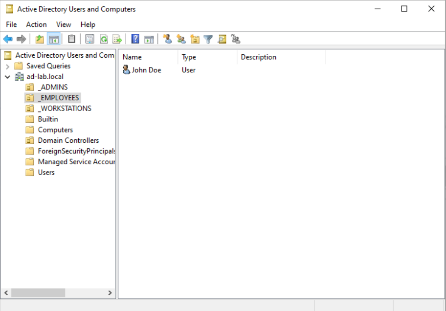
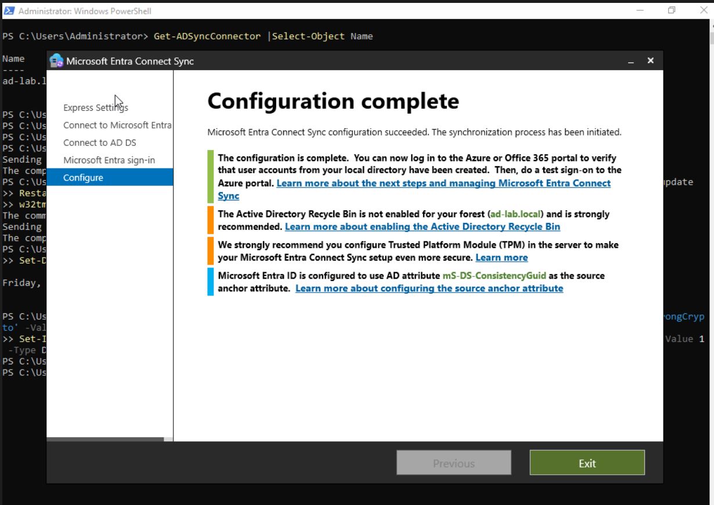
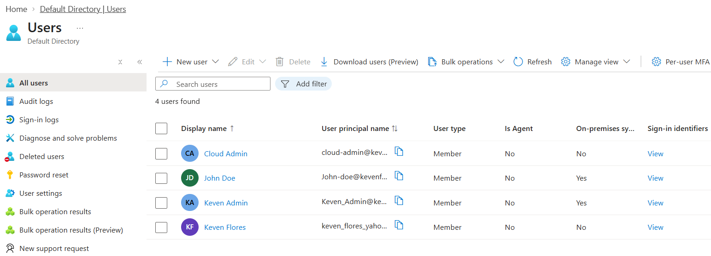
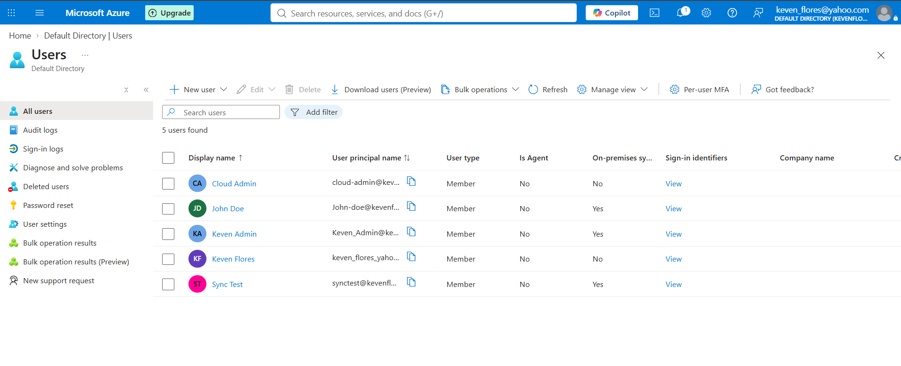
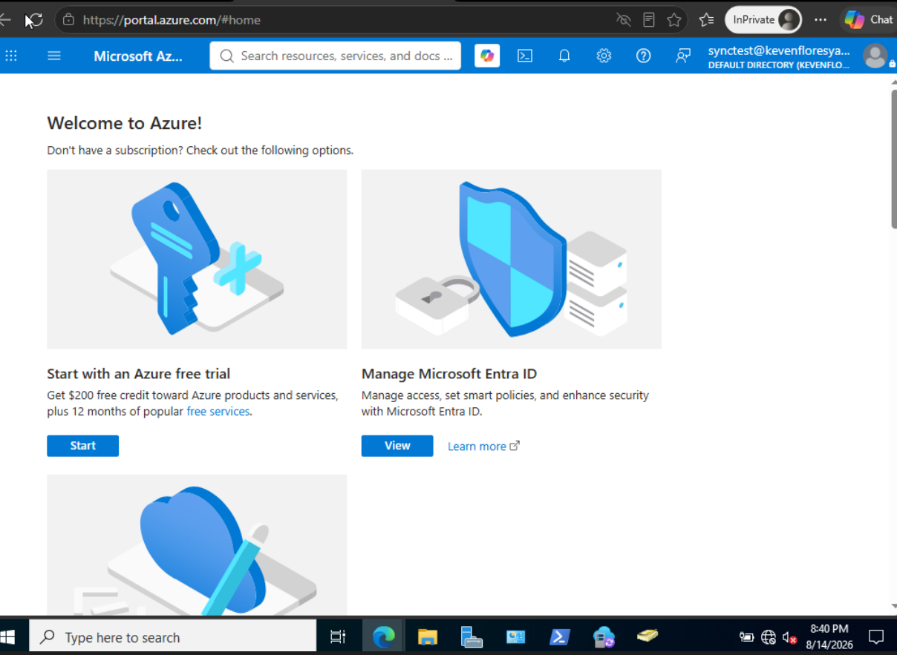
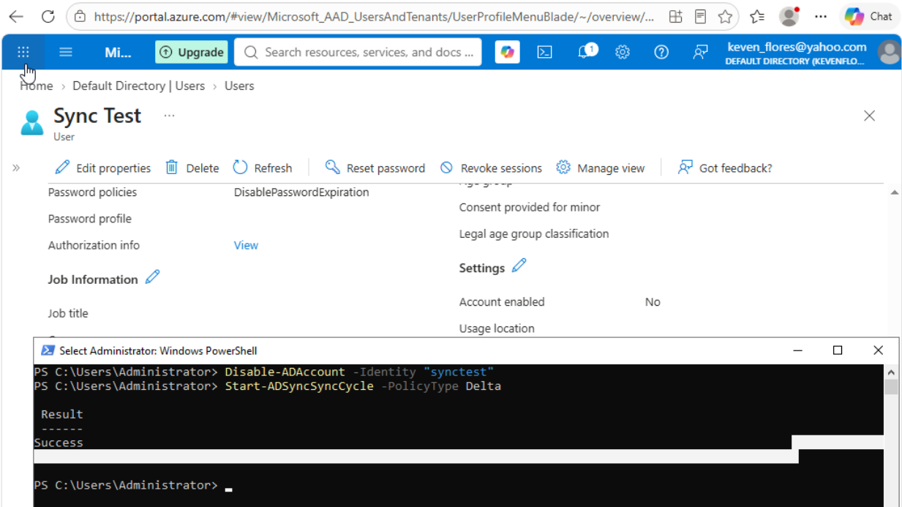
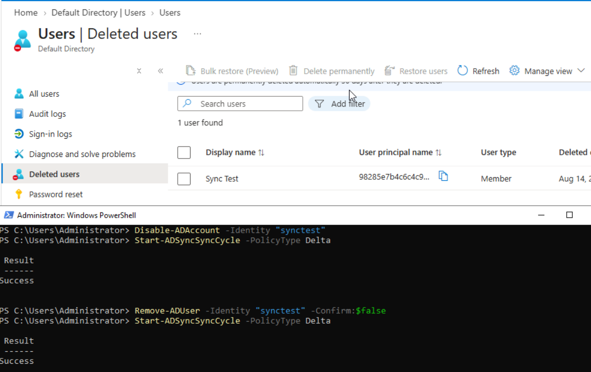

# Hybrid Identity Architecture: Active Directory (AD DS) to Microsoft Entra ID

Active Directory to Microsoft Entra ID (Azure AD) synchronization, Password Hash Synchronization (PHS), and identity lifecycle management using Microsoft Entra Connect.

---

## Project Overview

This project demonstrates the end-to-end implementation, synchronization, and lifecycle management of an enterprise **Hybrid Identity Architecture**. An on-premises Active Directory Domain Services environment (`ad-lab.local`) running on Windows Server 2022 was integrated with a cloud **Microsoft Entra ID** tenant using **Microsoft Entra Connect Sync**.

The implementation validates:
* Directory object synchronization using immutable source anchors (`mS-DS-ConsistencyGuid`).
* **Password Hash Synchronization (PHS)** enabling single sign-on (SSO) with cloud-enforced Multi-Factor Authentication (MFA).
* Real-time automated identity lifecycle management (**Joiner-Mover-Leaver / JML** workflows).
* Custom diagnostic engineering to resolve hypervisor clock drift, TLS cipher suite constraints, and sync engine agent collisions.

---

## Architectural Topology

```text
  +-------------------------------------------------------------------------+
  |                      ON-PREMISES LAB ENVIRONMENT                         |
  |                                                                         |
  |  +-------------------------------------------------------------------+  |
  |  | Windows Server 2022 (Domain Controller: DC-01)                    |  |
  |  | - Active Directory Domain Services (AD DS)                       |  |
  |  | - Domain Forest: ad-lab.local                                     |  |
  |  | - Schema, Configuration, and Domain Directory Partitions          |  |
  |  +---------------------------------+---------------------------------+  |
  |                                    |                                    |
  |                                    v                                    |
  |  +-------------------------------------------------------------------+  |
  |  | Microsoft Entra Connect Sync Engine                                |  |
  |  | - Metaverse Object Join & Attribute Projection Rules              |  |
  |  | - Connectors: ad-lab.local <---> kevenfloresyahoo.onmicrosoft.com  |  |
  |  | - Synchronization Schedule: 30-Minute Delta / PowerShell Trigger  |  |
  |  +---------------------------------+---------------------------------+  |
  +------------------------------------|------------------------------------+
                                       | TLS 1.2 / HTTPS (Port 443)
                                       | Microsoft Graph API / Modern Auth
                                       v
  +-------------------------------------------------------------------------+
  |                          MICROSOFT CLOUD TENANT                         |
  |                                                                         |
  |  +-------------------------------------------------------------------+  |
  |  | Microsoft Entra ID (Azure Active Directory)                       |  |
  |  | - Mastered Cloud Objects vs. Hybrid Synced Objects                |  |
  |  | - Password Hash Synchronization (PHS) Authentication              |  |
  |  | - Security Defaults Enforcement (Microsoft Authenticator MFA)     |  |
  |  | - 30-Day Soft-Delete Recycle Bin Retention                        |  |
  |  +-------------------------------------------------------------------+  |
  +-------------------------------------------------------------------------+
```

---

## Environment Specifications

| Component | Detail |
| :--- | :--- |
| **Virtualization** | Oracle VM VirtualBox |
| **Domain Controller Hostname** | `DC-01` |
| **Operating System** | Windows Server 2022 Standard (Build 20348) |
| **On-Premises Domain** | `ad-lab.local` (Private / Non-Routable TLD) |
| **Identity Synchronization** | Microsoft Entra Connect Sync v2.x |
| **Cloud Tenant Domain** | `kevenfloresyahoo.onmicrosoft.com` |
| **Authentication Strategy** | Password Hash Synchronization (PHS) + MFA |

---

## Implementation & Visual Evidence

### 1. Cloud Tenant Initialization & On-Premises AD Baseline
Before establishing hybrid synchronization, the cloud tenant operated in an isolated state with cloud-only administrative identities. On `DC-01`, Active Directory Domain Services was deployed alongside Organizational Units (OUs) and initial administrative accounts (`John Doe`, `Keven Admin`).

<p align="center">
  
  <br>
  <em>Figure 1.1: Microsoft Entra ID tenant baseline prior to on-premises directory connector integration.</em>
</p>

<p align="center">
  
  <br>
  <em>Figure 1.2: On-premises Active Directory forest (ad-lab.local) structural deployment on DC-01.</em>
</p>

---

### 2. Entra Connect Sync Deployment & Directory Binding
Microsoft Entra Connect was installed to establish the bridge between `ad-lab.local` and the cloud tenant. The setup mapped the private `.local` UPN suffix to the primary `@*.onmicrosoft.com` routing domain and configured `mS-DS-ConsistencyGuid` as the immutable cloud source anchor.

```powershell
# Enforce TLS 1.2 Strong Cryptography for .NET & Graph API Calls
Set-ItemProperty -Path 'HKLM:\SOFTWARE\Microsoft\.NETFramework\v4.0.30319' -Name 'SchUseStrongCrypto' -Value 1 -Type DWord -Force
Set-ItemProperty -Path 'HKLM:\SOFTWARE\Wow6432Node\Microsoft\.NETFramework\v4.0.30319' -Name 'SchUseStrongCrypto' -Value 1 -Type DWord -Force
```

<p align="center">
  
  <br>
  <em>Figure 2.1: Successful Entra Connect Sync engine deployment and initial directory replication trigger.</em>
</p>

---

### 3. Ingestion Verification & Synchronization Metrics
The local **Synchronization Service Manager** (`miisclient.exe`) was inspected to confirm that the import, projection, join, and export stages completed across both connector spaces without schema mismatch or attribute truncation.

<p align="center">
  
  <br>
  <em>Figure 3.1: Synchronization Service Manager operations metrics verifying clean Full Import, Full Sync, and Export runs.</em>
</p>

<p align="center">
  
  <br>
  <em>Figure 3.2: Microsoft Entra admin center reflecting on-premises accounts populated with 'On-premises sync enabled = Yes'.</em>
</p>

---

### 4. Dynamic Delta Provisioning & Password Hash Sync (PHS)
To validate automated provisioning, a test account (`Sync Test` / `synctest`) was created in local AD DS. An on-demand delta sync cycle was initiated via PowerShell, immediately projecting the identity into Entra ID.

```powershell
# Trigger on-demand delta synchronization
Start-ADSyncSyncCycle -PolicyType Delta
```

<p align="center">
  
  <br>
  <em>Figure 4.1: Live delta synchronization output successfully creating 'Sync Test' in Microsoft Entra ID.</em>
</p>

Cloud authentication was verified by executing an InPrivate login session using the on-premises password hash, followed by modern Multi-Factor Authentication enrollment:

<p align="center">
  
  <br>
  <em>Figure 4.2: Successful cloud portal sign-in as synctest@kevenfloresyahoo.onmicrosoft.com via Password Hash Sync.</em>
</p>

---

### 5. Identity Lifecycle Management (JML / Deprovisioning)
To demonstrate the **Leaver** security workflow:
1. **Access Revocation:** The account was disabled on `DC-01`. A delta sync cycle propagated the state to Entra ID, switching `Account enabled` to `No`.
2. **Directory Deprovisioning:** The account was removed from Active Directory. Entra Connect moved the cloud object to the **Deleted users** recycle bin and mangled the UPN with the object GUID to release the alias.

```powershell
# 1. Access Revocation (Disable Account)
Disable-ADAccount -Identity "synctest"
Start-ADSyncSyncCycle -PolicyType Delta

# 2. Complete Deprovisioning (Delete Account)
Remove-ADUser -Identity "synctest" -Confirm:$false
Start-ADSyncSyncCycle -PolicyType Delta
```

<p align="center">
  
  <br>
  <em>Figure 5.1: Real-time access revocation reflecting disabled account status in Microsoft Entra ID.</em>
</p>

<p align="center">
  
  <br>
  <em>Figure 5.2: Deleted user transitioning to Entra ID cloud recycle bin with 30-day soft-delete protection.</em>
</p>

---

## Lessons Learned & Technical Troubleshooting

### 1. PowerShell Background Module Resolution
* **Issue:** The installer threw `The term 'Get-ADSyncConnector' is not recognized as the name of a cmdlet...` despite the module existing on disk.
* **Root Cause:** Setup scripts execute inside a non-interactive background process that only searches `$env:PSModulePath`. Local profile paths are ignored by default.
* **Fix:** Deployed the `ADSync` binary modules globally to `C:\Program Files\WindowsPowerShell\Modules\ADSync` to allow system-wide module autoloading:
  ```powershell
  Copy-Item "C:\Program Files\Microsoft Azure AD Sync\Bin\ADSync" "C:\Program Files\WindowsPowerShell\Modules\" -Recurse
  ```

### 2. Connector Name Collisions on Setup Retry
* **Issue:** Retrying configuration triggered `Management Agent Error: A management agent with this name already exists.`
* **Root Cause:** Failed setup attempts leave orphaned connector entries inside the local LocalDB SQL instance.
* **Fix:** Flushed stale database records via PowerShell:
  ```powershell
  Get-ADSyncConnector | Remove-ADSyncConnector
  ```

### 3. Hypervisor Clock Skew & OAuth Rejection
* **Issue:** Entra Connect halted on `Could not configure application-based authentication for this server.`
* **Root Cause:** VirtualBox clock drift caused the guest OS to lag behind UTC real time by >20 minutes. Azure/Entra OAuth token endpoints strictly enforce a **5-minute clock skew threshold**. VirtualBox network adapters dropped outbound UDP 123 (NTP) packets, blocking `w32tm`.
* **Fix:** Synchronized the system clock over HTTPS headers via PowerShell:
  ```powershell
  $webTime = (Invoke-WebRequest -Uri "[https://www.google.com](https://www.google.com)" -UseBasicParsing).Headers.Date
  Set-Date $webTime
  ```

### 4. Enterprise (Work/School) vs. Consumer Identity Endpoints
* **Issue:** Cloud login tests failed with `We couldn't find a Microsoft account`.
* **Root Cause:** The browser redirected authentication to `login.live.com` (consumer Microsoft Account / MSA) instead of the organizational directory endpoint (`login.microsoftonline.com`).
* **Fix:** Targeted enterprise endpoints (`https://portal.azure.com` / `https://entra.microsoft.com`) explicitly under the **Work or School** account context.

---

## PowerShell Administration Cheat Sheet

```powershell
# ==========================================
# HYBRID IDENTITY POWERSHELL COMMAND SUMMARY
# ==========================================

# 1. Force Immediate Synchronization Cycles
Start-ADSyncSyncCycle -PolicyType Delta    # Delta Sync (Modified attributes only)
Start-ADSyncSyncCycle -PolicyType Initial  # Full Sync (Entire directory re-evaluation)

# 2. Check Local Sync Engine Connector Status
Get-ADSyncConnector | Select-Object Name, Type

# 3. Synchronize Host Time via Web Request (NTP Drop Workaround)
Set-Date ((Invoke-WebRequest -Uri "[https://www.google.com](https://www.google.com)" -UseBasicParsing).Headers.Date)

# 4. Identity Lifecycle Management Commands
New-ADUser -Name "Test User" -SamAccountName "tuser" -UserPrincipalName "tuser@ad-lab.local" `
    -AccountPassword (ConvertTo-SecureString "Password123!" -AsPlainText -Force) -Enabled $true
Disable-ADAccount -Identity "tuser"
Remove-ADUser -Identity "tuser" -Confirm:$false
```
